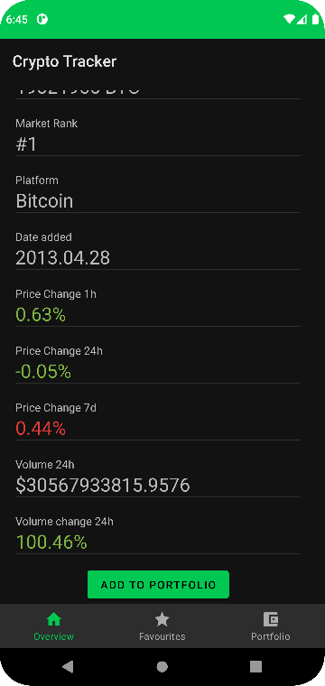
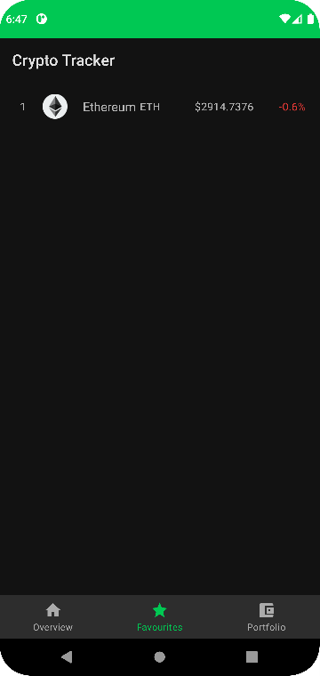
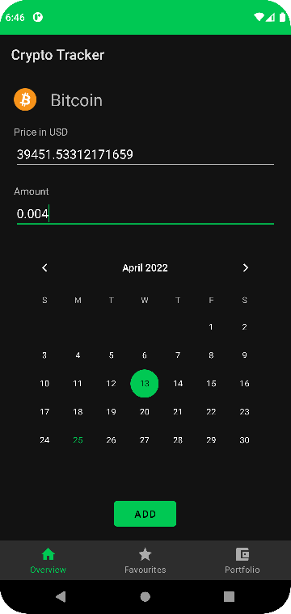

# CryptoTracker Android app

Videó az alkalmazásról működés közben: 
[YouTube-on](https://youtu.be/t1b9z856VwI)

##Képek:

## Főbb funkciók:
- Kriptovaluták listázása
- Kriptovaluta fontosabb adatainak megjelenítése
- Kriptovaluta keresése név és szimbólum alapján
- Kriptovaluta felvétele a kedvencek köze
- Portfolió megjelenítése PieCharton és BarCharton
- Kedvencek és tranzakciók mentése lokálisan
- Kriptovaluták adatainak mentése lokálisan
- Kriptovaluták adatainak lekérése CoinMarketCap API segítségével
- Cache funkció: 5 perc után API-ból frissíti az adatokat, egyébként lokálisan mentett adatokat használ

## Felhasznált technológiák/könyvtárak:
- Activity
- Fragment
- ViewPager2
- NavigationBar
- Egyedi UI
- RecycleView
- Retrofit, Moshi
- Glide
- Room
- MPAndroidChart
- Dagger Hilt

## Alkalmazott tervezési minták:
- Repository
- MVVM
- Dependency Injenction
- Factory
- ViewHolder
- Adapter
